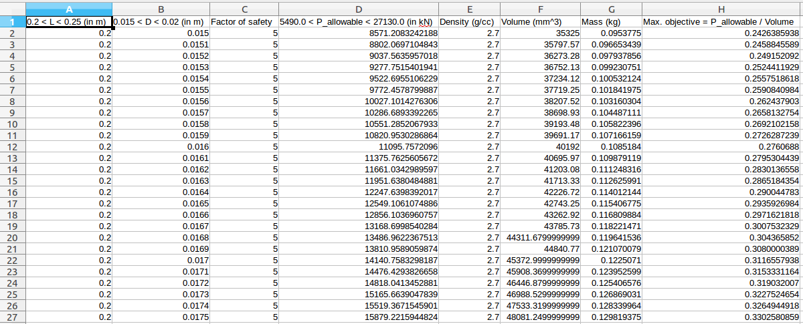

# DOME PROJECT

This is a part of the group project that was done for the course Design Of Machine Elements (DOME), during the Spring semester 2016 - 2017. 

### Team Members

- [Athitya Kumar](https://github.com/athityakumar)
- Gopal Krishna
- Dipika Agrahari
- Yechuri Rahul

### About the codebase

The [`watts.rb`](https://github.com/athityakumar/dome-project/blob/master/watts.rb) is a Ruby script that is used to find out the optimal configuration of a Watts Arm, by traversing through all possible combinations of the Arm dimensions and materials - to maximize the allowable load `(P)` while also minimizing the volume `(V)`. Hence, the term `P/V` has been maximized to find the optimal solution.

All the traversed combinations, and the optimal solutions are written into `.csv` files, for even a layman to have at the data easily.

- [Excel file for Aluminium Watts Arm](https://github.com/athityakumar/dome-project/blob/master/Aluminium.csv)
- [Excel file for Carbon Steel Alloy Watts Arm](https://github.com/athityakumar/dome-project/blob/master/Carbon_Steel_Alloy.csv)
- [Excel file for Optimals of Materials](https://github.com/athityakumar/dome-project/blob/master/Optimals.csv)

### Screenshot

### License

Anyone is free to do anything they want with this script.